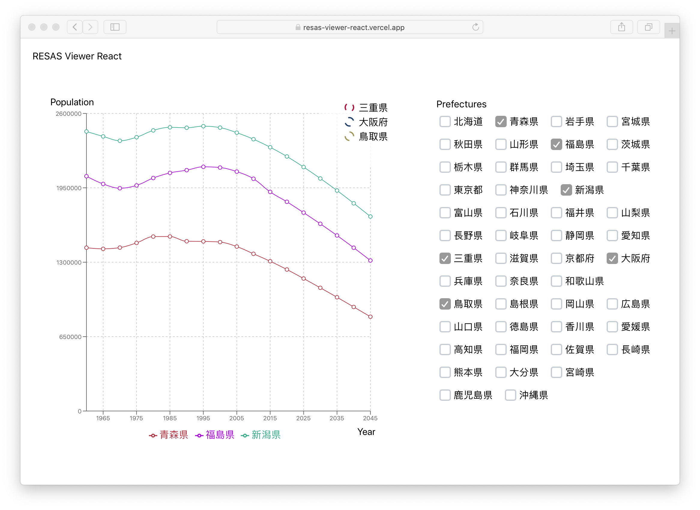
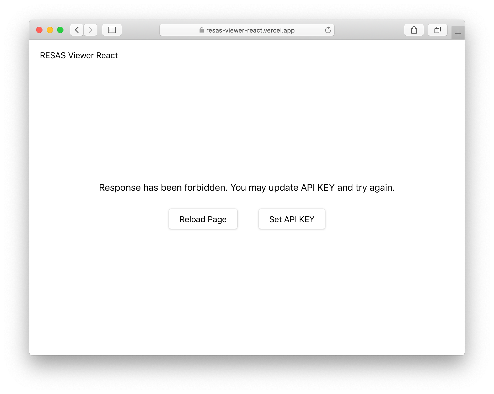

# RESAS Viewer React

An online viewer for [RESAS](https://opendata.resas-portal.go.jp/) making by React.

[Online Access](https://resas-viewer-react.vercel.app)

## Screeenshots



## First time to use

[RESAS](https://opendata.resas-portal.go.jp/) need API to make requests,
we do not provide our API, so you will meet this error at the first time.



Press <kbd>Set API KEY</kbd> and enter your own RESAS API key,
then you will be ready to use after pressing <kbd>Back</kbd>

## Installation

```bash
yarn && yarn start
```

If you want to fill the API key by default, run it by

```bash
REACT_APP_API_KEY=xxxx yarn start
```

## Testing

```bash
yarn test
```
